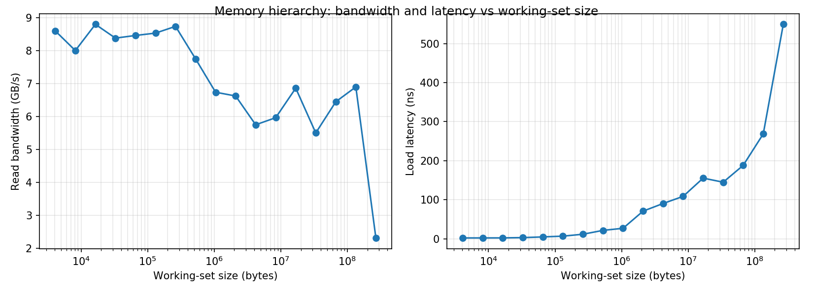

# Memory Hierarchy Benchmark (C + Python)

A small, self-contained benchmark that measures **memory read bandwidth** and **load latency** for working sets from 4 KB to 256 MB. It shows how performance changes as data moves from the L1 cache to L2, L3 and main memory (DRAM), and it compares the measured behavior with the cache sizes reported by the CPU.

**Contents**
1. [Why this project is useful](#why-this-project-is-useful)
2. [What was done](#what-was-done)
3. [Background concepts](#background-concepts)
4. [How the benchmark works](#how-the-benchmark-works)
5. [Files](#files)
6. [Test system](#test-system)
7. [How to run](#how-to-run)
8. [Results](#results)
9. [Analysis](#analysis)
10. [Relevance to SoC performance analysis](#relevance-to-soc-performance-analysis)
11. [Limitations](#limitations)
12. [Possible extensions](#possible-extensions)
13. [Troubleshooting](#troubleshooting)
14. [Glossary](#glossary)

---

## Why this project is useful

Processors have become much faster than main memory, so many programs spend most of their time waiting for data instead of computing. This gap is often called the **memory wall**. Computer systems hide it with a hierarchy of small, fast caches in front of large, slow DRAM.

Measuring that hierarchy is useful because it lets you:

- **See the cache sizes and latencies in real measurements**, not just in a textbook diagram.
- **Tell whether a workload is latency-bound or bandwidth-bound**, which decides what kind of optimization helps.
- **Predict performance from data size.** A program whose working set fits in cache can run many times faster than one that spills to DRAM.
- **Compare measured behavior against architectural expectations**, which is the core habit of performance analysis: measure, compare with what the architecture predicts, then explain any gap.
- **Build the measurement skills** (C benchmarking, timing, scripting, plotting) used in hardware performance work.

## What was done

- Wrote a **C benchmark** (`membench.c`) that measures sequential read bandwidth and pointer-chasing load latency for working sets from 4 KB to 256 MB, doubling the size at each step.
- Wrote a **Python script** (`analyze.py`) that compiles and runs the benchmark, parses the CSV output, prints a results table and plots bandwidth and latency against working-set size.
- **Ran it on Linux** (Ubuntu in a virtual machine) on an Intel Core i5-6300U and read the CPU cache sizes with `lscpu`.
- **Ran the benchmark twice** and compared the runs to see run-to-run variation.
- **Interpreted the results** by matching the latency curve against the L1, L2 and L3 sizes, and noted where the measurements differ from the simple expectation (see Limitations).
- **Documented** the method, results and limitations in this README.

## Background concepts

### Latency and bandwidth
- **Latency** is the time for one memory access to complete (measured here in nanoseconds per load).
- **Bandwidth** is how much data can be moved per unit time (measured here in GB/s).
- They are different. A system can have high bandwidth but high latency, and workloads stress one or the other. A pointer-chasing loop is limited by latency; a streaming loop is limited more by bandwidth.

### Memory hierarchy
| Level | Typical role | Typical relative speed |
|---|---|---|
| Registers | Values the CPU is working on | Fastest |
| L1 cache | Small, private to each core | Very fast (a few cycles) |
| L2 cache | Larger, slower than L1 | Fast |
| L3 cache | Larger again, usually shared between cores | Slower |
| DRAM | Main memory | Much slower (tens to hundreds of ns) |

Exact sizes and latencies depend on the CPU, so this project measures them instead of assuming them.

### Working set and locality
- The **working set** is the amount of data a program actively uses. When it fits in a cache level, accesses are served quickly from that level. When it exceeds the cache, misses go to the next level.
- **Temporal locality:** recently used data is likely to be used again soon.
- **Spatial locality:** data near recently used data is likely to be used soon. Caches exploit this by loading a whole **cache line** (commonly 64 bytes) at a time.

### Cache hits, misses and average access time
- A **hit** means the data is found in the cache; a **miss** means it must be fetched from a lower level.
- **Average Memory Access Time (AMAT)** = hit time + miss rate x miss penalty. As the working set grows past a cache size, the miss rate rises, so the average access time rises.

### Hardware prefetching
CPUs detect simple access patterns (such as sequential reads) and fetch data before it is requested. This hides latency for sequential access, which is why streaming reads can achieve good bandwidth even from DRAM. It cannot help when every address depends on the previous load, as in pointer chasing.

### Dependent loads and pointer chasing
If each load's address comes from the previous load's result, the CPU cannot overlap the loads or predict the next address. The time per load then reflects the true latency of whichever memory level currently holds the data. This is the standard technique for measuring memory latency.

### Virtual memory and the TLB
Programs use virtual addresses that are translated to physical addresses. The **TLB** caches recent translations. With very large working sets, TLB misses add extra time to each access, which contributes to the rise in latency at large sizes.

## How the benchmark works

### Bandwidth test
- Allocates an array of 64-bit integers of the chosen size and fills it.
- Sums the whole array sequentially and repeats until about 1 GB of data has been read in total.
- Reports bytes read divided by elapsed time, in GB/s.
- The sum result is stored in a `volatile` variable so the compiler cannot remove the loop.

### Latency test
- Builds an array where each element holds the index of the next element to visit.
- The order is a **random single cycle** made with a Sattolo shuffle, so the chain visits every element exactly once before returning to the start. Random order defeats the prefetcher and spatial locality.
- Performs 20 million dependent loads (`p = next[p]`) and reports the average time per load in nanoseconds.

### Timing and build
- Time is taken with `clock_gettime(CLOCK_MONOTONIC)` for nanosecond resolution.
- Compiled with `gcc -O2`.
- `analyze.py` compiles and runs the C program, parses the CSV output, prints a table, and saves `results.csv` and a plot.

## Files

| File | Purpose |
|---|---|
| `membench.c` | The benchmark (C) |
| `analyze.py` | Builds, runs, parses and plots (Python) |
| `results.csv` | Raw results from my run |
| `memory_hierarchy.png` | Bandwidth and latency plot |

## Test system

| Item | Value |
|---|---|
| CPU | Intel Core i5-6300U @ 2.40 GHz |
| L1d / L1i | 32 KB / 32 KB |
| L2 | 256 KB |
| L3 | 3072 KB |
| Environment | Ubuntu inside a virtual machine |
| Compiler | gcc -O2 |
| Python | 3.6 with matplotlib |

## How to run

    sudo apt update
    sudo apt install -y build-essential python3 python3-matplotlib
    python3 analyze.py

The run takes a minute or two and writes `results.csv` and `memory_hierarchy.png`. Close other heavy programs first for cleaner numbers. To see the CPU's cache sizes for comparison:

    lscpu | grep -i -E "model name|cache"

## Results

| Working set | Bandwidth (GB/s) | Latency (ns) |
|---:|---:|---:|
| 4 KB | 8.60 | 2.12 |
| 8 KB | 8.00 | 2.17 |
| 16 KB | 8.80 | 2.27 |
| 32 KB | 8.38 | 2.98 |
| 64 KB | 8.46 | 4.78 |
| 128 KB | 8.53 | 6.71 |
| 256 KB | 8.74 | 11.65 |
| 512 KB | 7.75 | 21.53 |
| 1 MB | 6.74 | 26.82 |
| 2 MB | 6.62 | 70.74 |
| 4 MB | 5.75 | 90.35 |
| 8 MB | 5.96 | 108.61 |
| 16 MB | 6.86 | 155.33 |
| 32 MB | 5.50 | 144.90 |
| 64 MB | 6.45 | 188.11 |
| 128 MB | 6.90 | 268.61 |
| 256 MB | 2.31 | 549.25 |

## Analysis

- **Up to 32 KB (fits in L1):** load latency is about 2-3 ns.
- **64 KB to 256 KB (L2 range):** latency rises gradually from about 5 ns to about 12 ns.
- **512 KB to 1 MB:** latency is about 22-27 ns, consistent with accesses served by the L3 cache.
- **2 MB and above:** latency reaches about 70 ns at 2 MB and exceeds 100 ns from 8 MB onward, consistent with accesses going to DRAM.
- **Bandwidth:** sequential read bandwidth is about 8-9 GB/s while data fits in the caches and falls to roughly 5.5-7 GB/s for large working sets. Bandwidth changes much less than latency because the hardware prefetcher hides much of the latency for sequential reads, and the single-threaded scalar loop is itself a limit on in-cache speed.

The latency curve follows the L1, L2 and L3 sizes reported by `lscpu`, which is the behavior a cache hierarchy predicts.

## Relevance to SoC performance analysis

The same method used here applies to SoC-level performance work:

- **Measure, then compare with expectation.** Cache sizes and latencies give an expected shape; the measured curve either matches or reveals a gap to investigate.
- **Bottleneck identification.** Separating latency-bound behavior (pointer chasing) from bandwidth-bound behavior (streaming) is a first step in finding where a system spends its time.
- **System-level interaction.** In an SoC, memory accesses pass through caches, an on-chip bus and a memory controller before reaching DRAM. The latency steps seen here are the combined effect of those stages.
- **Workload characterization.** Varying the working-set size is a basic way of characterizing how a workload uses the memory system.
- **Tooling.** Automating runs, parsing output and plotting results in Python is the kind of scripting used in performance-analysis infrastructure.

## Limitations

- The benchmark ran **inside a virtual machine**, so results include virtualization overhead and noise. Two runs showed the same trends but different absolute numbers (for example the 256 MB latency and bandwidth varied noticeably).
- Latency rises earlier than the 3 MB L3 size alone would predict (about 70 ns at 2 MB). Possible causes are the L3 being shared with the host and other processes, and TLB cost. I have not isolated which factor dominates.
- The bandwidth test is a single-threaded scalar loop, so it does not reach the machine's peak memory bandwidth.
- Bandwidth values are noisy, so treat them as indicative rather than precise.
- Hardware performance counters (`perf`) were not used because they are generally unavailable inside a VM.

## Possible extensions

- Add sequential, strided and random access patterns to the bandwidth test
- Collect hardware counters with `perf stat` on a native Linux machine
- Repeat runs and report the median and spread
- Compare against a native (non-VM) run
- Run the same experiment on a bare-metal target

## Troubleshooting

- **`No module named matplotlib`**: run `sudo apt install -y python3-matplotlib`. The table still prints without it, but the plot needs it.
- **`gcc: command not found`**: run `sudo apt install -y build-essential`.
- **`Killed` or out-of-memory error**: the machine has too little RAM for the largest test. In `membench.c`, lower the maximum size in the main loop (for example from 256 MB to 64 MB) and rerun.
- **`capture_output` or `text=True` errors on Python 3.6**: use the `analyze.py` in this repository, which works on Python 3.6 and later.
- **Noisy or unstable numbers**: close other applications and repeat the run several times.

## Glossary

- **Cache line:** the unit of data moved between memory levels, commonly 64 bytes.
- **Capacity miss:** a miss that happens because the working set is larger than the cache.
- **Prefetcher:** hardware that fetches data ahead of use when it detects an access pattern.
- **TLB:** a cache of virtual-to-physical address translations.
- **AMAT:** average memory access time.
- **Working set:** the data a program actively uses over a period of time.
- **Memory wall:** the growing gap between processor speed and memory speed.
